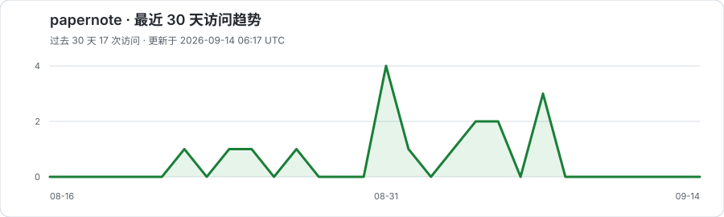

# Papernote

Papernote 是一个面向安全研究者和工程师的中文论文阅读站。它每周整理安全论文，提供结构化精读、必要的名词解释、作者与单位关系，以及有证据基础的行业观点。

在线浏览：<https://wyinleo.github.io/papernote/>

## 可以看到什么

- **学术论文**：按周次或安全主题浏览论文，左侧导航默认显示 5 条，可展开或收起；详情顶部按单位列出作者，Easycatch 从生活故事或实际使用场景切入，再接到论文的问题与思路，再展开方法示例、实验、局限和实践意义。
- **学术关系**：在平面全球地图上按国家 / 地区查看库内论文分布，色深表示去重论文数，虚线弧线表示跨国 / 地区合作，不显示自环；悬停国家时显示合作连线，移开隐藏；支持键盘聚焦和触屏轻触。下方按国家、单位、学者分三列排名，可按年份、学科和单位查看关系。单位按已核验的大学或机构归并，原始院系署名保留在论文详情。地图含预印本，单位与学者的顶会分数单独保留核验口径，不代表完整排名。
- **行业观点**：精选包含原创方法、数据、漏洞细节或工程经验的公开报告，并注明证据边界与商业利益相关。

论文周报保存在 [`weekly/`](weekly/)，适合直接阅读或引用。论文索引与行业观点分别保存在 [`papers/index.jsonl`](papers/index.jsonl) 和 [`industry/viewpoints.json`](industry/viewpoints.json)。具体的论文阅读和整理方式见 [`docs/paper-reading-guide.md`](docs/paper-reading-guide.md)。

## 本地浏览

项目只使用静态 HTML、CSS 和 JavaScript。需要 Python 3，无需安装前端框架：

```bash
python3 scripts/build_site.py --check
python3 scripts/build_site.py
python3 -m http.server 8000 -d site
```

然后访问 <http://localhost:8000>。

## 部署

推送到 `main` 后，[`.github/workflows/pages.yml`](.github/workflows/pages.yml) 会校验数据、生成网页缓存并发布 `site/` 到 GitHub Pages。部署前请确保 `python3 scripts/build_site.py --check` 通过。

访问趋势由 GoatCounter 的无 Cookie 聚合统计生成，站点尊重浏览器的“请勿跟踪”设置，不公开个人访问记录。页脚的“隐私说明”链接提供完整说明，另有 Yamayuki's Space 入口。



## 内容说明

Papernote 优先收录安全领域正式会议论文，也会保留有价值的 arXiv 预印本；预印本会明确标注尚未经过同行评审。论文卡片的时间取正式发表时间，尚未正式发表时才显示预印版本时间，不显示仓库落库时间。论文摘要是便于阅读的中文整理，不替代原文，也不把作者或单位知名度作为质量判断依据。

## 数据加载

Markdown 周报、JSONL 索引和实体表仍是维护来源。构建器生成轻量目录 `site/data.js` 和 `site/data/` 下的内容哈希 JSON：论文详情按篇加载，学术关系在首次查看地图或学者时加载，全文搜索按涉及的周次加载。请求在页面内去重并缓存，失败可重试。

`site/data/` 是忽略入库的生成目录，本地预览和部署前必须执行构建；GitHub Pages 工作流会自动生成。性能测量、缓存和未来 SQLite 演进方案见 [`docs/data-architecture.md`](docs/data-architecture.md)。
